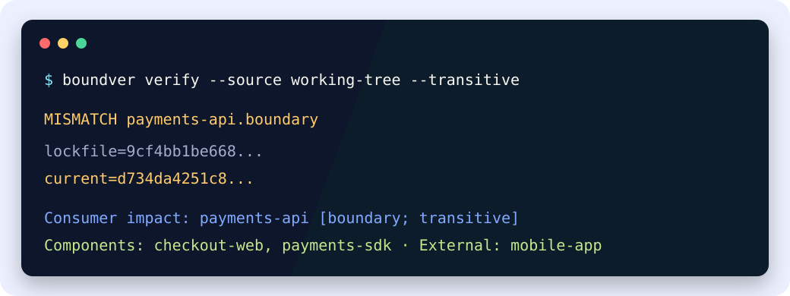

# Know which contracts changed — and which consumers to verify

**boundver classifies declared contract drift and downstream impact across
polyglot repositories.** It gives CI a portable answer when APIs, schemas,
generated artifacts, configuration, and package surfaces cross compiler or
build-system boundaries.

[Start the one-minute demo](demo.md){ .md-button .md-button--primary }
[Review the 17-component case study](case-study-range-review.md){ .md-button }
[Install boundver](getting-started.md){ .md-button }



## Four signals instead of one changed bit

| Facet | What it tells reviewers |
|---|---|
| `exact` | Some tracked component byte or file identity changed. |
| `behavior` | A declared observable-behavior input changed. |
| `boundary` | A declared public artifact changed. |
| `compat` | The configured compatibility family changed. |

Boundver stores those identities in `boundary.lock.json`. Later verification
compares the same Git snapshot model, applies per-component policy, and reports
declared direct or transitive consumers.

```bash
python -m pip install "boundver[schema,yaml]"
boundver init
boundver generate --source working-tree
boundver verify --source working-tree
```

## Use it with the tools you already have

Boundver does not replace compilers, affected-build graphs, schema-specific
compatibility analysis, or consumer tests. It provides the classification and
routing signal between them:

```text
Git snapshot -> boundver drift class -> semantic checker -> affected consumer suites
```

For example, boundary drift in an OpenAPI artifact can trigger oasdiff and only
the consumer suites reachable from that API in the declared graph. See
[comparison and integrations](comparison.md).

## Choose your path

- New repository: follow [getting started](getting-started.md).
- Existing monorepo: use [gradual adoption](gradual-adoption.md).
- Reviewing a branch: use [historical range review](reference.md#historical-range-review).
- Evaluating a real branch workflow: run the [17-component case study](case-study-range-review.md).
- CI integration: copy a recipe from the [CI cookbook](ci-cookbook.md).
- Runtime expectations: see the reproducible [performance contract](performance.md).
- Containers, Homebrew, or GitLab: see [distribution](distribution.md).
- Evaluating the model: read [why boundver](WHY_BOUNDVER.md).
- Sources, exit codes, facet availability: see [reference](reference.md).

!!! important

    A clean boundver result means declared inputs agree with their recorded
    identities. It is not proof of semantic or backward compatibility.
